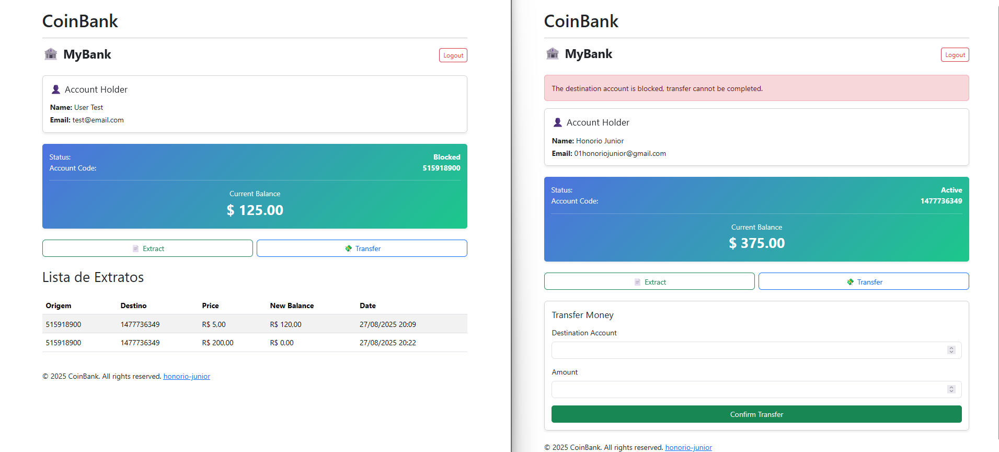

# CoinBank
O CoinBank é um projeto desenvolvido como parte de um desafio prático para avaliar habilidades técnicas em desenvolvimento com Laravel. O objetivo principal é criar um sistema de gerenciamento de contas bancárias que permita a administração de usuários, contas e transferências de forma segura e eficiente.


## Funcionalidades Principais

* Gerenciamento de Usuários: CRUD de usuários com status de aprovação.
* Contas Bancárias: Criação de contas e controle de status (ATIVA, BLOQUEADA).
* Transferências: Permite transferências entre contas, respeitando regras de saldo e status.
* Extrato de Transferências: Registro automático de transferências realizadas, com detalhes da operação.



> Este projeto visa proporcionar uma experiência prática em desenvolvimento web, focando em boas práticas e segurança nas operações financeiras.

### Requisitos

* PHP >= 8.4

* Composer

* MySQL/SQLite ou outro banco de dados compatível


### Instalação
1. Clonar o repositório
```
git clone https://github.com/honorio-junior/CoinBank.git
cd CoinBank
```

2. Instalar dependências PHP
```
composer install
```

3. Copiar arquivo de ambiente
```
cp .env.example .env
```

4. Configurar .env
```
* configurar conforme o ambiente que esta sendo utilizado
```

5. Gerar chave da aplicação
```
php artisan key:generate
```

6. Executar migrations
```
php artisan migrate
```

### Executar o projeto
```
php artisan serve
```

O projeto estará disponível em:
http://localhost:8000
